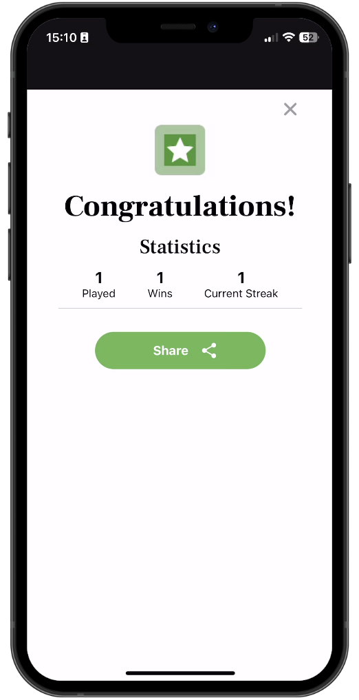

# React Native Wordle Clone with Clerk

This is a React Native Wordle clone using [Clerk](https://go.clerk.com/ztAWdYK) for user accounts to replicate the popular game [Wordle](https://www.nytimes.com/games/wordle/index.html). This project is a great way to learn how to build a full-stack mobile app with React Native, Firebase, and Clerk.

Additional features:

- [Expo Router](https://docs.expo.dev/routing/introduction/) file-based navigation
- [React Native SVG](https://github.com/software-mansion/react-native-svg) for SVG rendering
- [Bottom Sheet](https://ui.gorhom.dev/components/bottom-sheet/) for bottom sheet component
- [Reanimated](https://docs.swmansion.com/react-native-reanimated/) for powerful animations
- [MMKV](https://github.com/mrousavy/react-native-mmkv) for storing key-value pairs
- [React Native LI](https://github.com/jsamr/react-native-li/tree/master/packages/react-native-li) for web-like lists

## App Screenshots

## Demo

## 🚀 More

**Take a shortcut from web developer to mobile development fluency with guided learning**

Enjoyed this project? Learn to use React Native to build production-ready, native mobile apps for both iOS and Android based on your existing web development skills.

